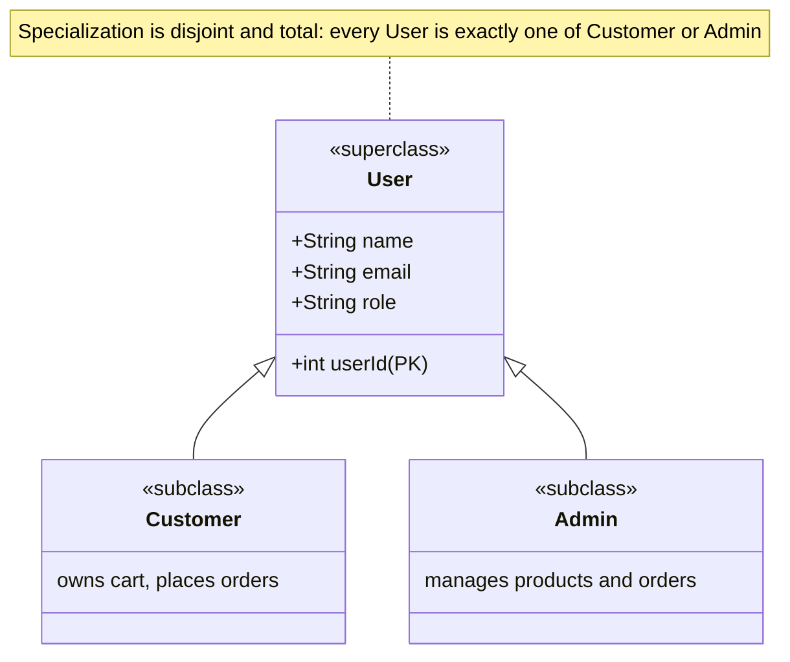
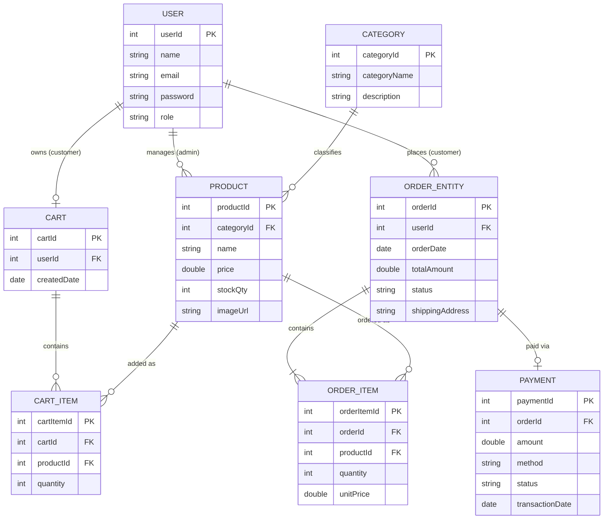
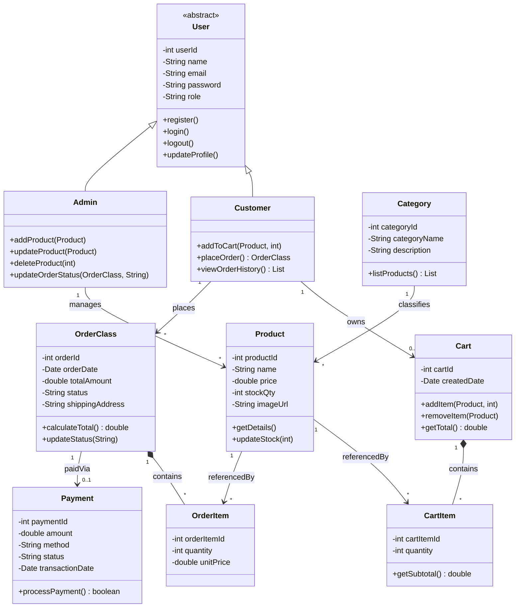

# PowerTool & Machinery Website — Project Documentation
**Group 21 · Client: Jayarathna Power Tools**

---

## 1. Project overview

| Item | Detail |
|---|---|
| Client | Jayarathna Power Tools (SME, physical retail shop) |
| Client contact | Sachintha Jayarathna — 0771040346 |
| Problem | Sells only in-store, no online presence, has a POS system and stock database but no way to reach customers online |
| Goal | Build a web platform for browsing, ordering, and admin-side stock/order management |
| Team | Nisal (IT25102772), Weerawardhana L.R.S.T (IT25102763), Pushpakumara W J (IT25102759), Perera M.R.S (IT25102769) |
| Tools | GitHub, IntelliJ IDEA, Google Drive / WhatsApp for docs |

## 2. Scope

**In scope (MVP)**
- Guest browsing (no account needed) — view products, search, see prices
- Customer registration/login, cart, checkout, order history
- Admin dashboard — add/update/delete products, manage stock, view & update order status

**Out of scope for now**
- Online payment gateway integration (Koko Payment) — orders can be placed with a manual/COD-style flow initially; the data model reserves a `Payment` entity so the gateway can be plugged in later without a schema change

## 3. Module ownership

| Module | Owner | Front-end | Back-end |
|---|---|---|---|
| Product Catalog & Search | Nisal | Listing page, search bar, product cards, detail page | `Product` entity, repository, service, controller |
| Shopping Cart & Checkout | Weerawardhana | Cart page, quantity controls, checkout form | Cart logic (session/DB), cart service, order placement |
| User Registration & Auth | Pushpakumara | Register page, login page, profile page | `User` entity, auth logic, session handling |
| Admin Panel & Order Mgmt | Perera | Admin dashboard, product forms, order list | `Order` entity, admin controllers, order status updates |

Each member owns both ends of their module and prepares the use-case scenario + activity diagram for it. Everyone works on a separate feature branch and merges into the integrated system.

## 4. Timeline

| Phase | Duration | Key tasks | Output |
|---|---|---|---|
| 1. Requirements & analysis | Week 1 | Stakeholder meetings, scope sign-off | Requirements doc |
| 2. System design | Weeks 2–3 | EER diagram, class diagram, use-case diagrams, wireframes, DB schema | Design artifacts (this document) |
| 3. Environment setup | Week 3 | Repo, branching model, DB instance, project skeleton per module | Working scaffold on GitHub |
| 4. Module implementation (parallel) | Weeks 4–7 | Each member builds their module's front-end + back-end | Four working modules on separate branches |
| 5. Integration | Week 8 | Merge branches, wire modules together, resolve conflicts | Single integrated build |
| 6. Testing | Week 9 | Unit tests per module, integration testing, UAT with client | Bug list, test report |
| 7. Bug fixing & polish | Week 10 | Fix issues from testing, UI polish | Stable release candidate |
| 8. Deployment & handover | Week 11 | Deploy, client walkthrough, handover docs | Live/staged site + user guide |
| 9. Documentation & presentation | Week 12 | Final report, slides, demo | Final submission |

## 5. Milestones

- **M1** — Design sign-off: EER + class diagrams approved, DB schema finalized
- **M2** — All four modules functionally complete on their own branches
- **M3** — Integrated build passes end-to-end flow: browse → cart → checkout → order → admin sees order → admin updates status
- **M4** — UAT with client (Sachintha Jayarathna) completed, feedback incorporated
- **M5** — Final deployment and presentation

## 6. Risks

| Risk | Mitigation |
|---|---|
| Merge conflicts across modules touching shared entities (e.g. `Product`, `User`) | Agree on entity ownership early; small, frequent merges instead of one big merge at the end |
| Payment gateway deferred but expected later | Data model already includes a `Payment` entity linked optionally to `Order`, so it can be added without restructuring |
| Uneven workload between front-end and back-end within a module | Each member explicitly owns both ends of their module (per the responsibility table) |
| Client availability for feedback | Keep the WhatsApp group active; schedule fixed check-in points rather than ad hoc |

---

## 7. EER Diagram

### 7.1 Specialization / generalization

`User` is the superclass. Its specialization into `Customer` and `Admin` is **disjoint** (a user is one or the other, never both) and **total** (every `User` row must be a `Customer` or an `Admin` — no bare `User` instances). Mermaid's ER notation has no triangle symbol for this, so it's expressed here as a class-style generalization instead:



### 7.2 Full entity-relationship structure

`USER` below stands in for whichever subclass owns that relationship — the cart/order relationships imply the `Customer` role, and the "manages" relationship implies the `Admin` role.



**Design note:** `Payment` is deliberately optional off `Order` (`o|`), since the payment gateway (Koko Payment) is out of scope for the MVP. This lets the system launch with a manual/COD order flow and wire in online payment later without changing the schema.

---

## 8. Class Diagram

`User` is abstract — every instance is either a `Customer` or an `Admin`, matching the disjoint/total specialization above. `Cart`–`CartItem` and `Order`–`OrderItem` are drawn as **composition** (the items have no existence independent of their parent), while `Product`–`CartItem`/`OrderItem` stay as plain associations, since a product outlives any single cart or order line referencing it. (`OrderClass` is used in place of `Order` only to avoid a naming clash with a reserved word in the diagram tool.)



---

## 9. Tech Stack

### Backend (`api/`)
- **Language:** Java 25
- **Framework:** Spring Boot 4.1.1
- **Build Tool:** Apache Maven (with Maven Wrapper)
- **Database:** MySQL with Spring Data JPA
- **Migrations:** Flyway
- **API Documentation:** SpringDoc OpenAPI (Swagger UI)

### Frontend (`web/`)
- **Framework:** Next.js 16 (React 19)
- **Language:** TypeScript
- **Styling:** Tailwind CSS v4
- **UI Components:** shadcn/ui
- **Package Manager:** pnpm

## 10. Project Structure

```
se2012-powertools-group-21/
├── api/                          # Spring Boot backend
│   ├── src/main/java/            # Java source files
│   ├── src/main/resources/       # Configuration files
│   ├── src/test/                 # Test files
│   └── pom.xml                   # Maven dependencies
├── web/                          # Next.js frontend
│   ├── app/                      # Next.js app directory
│   ├── components/               # React components
│   ├── lib/                      # Utility functions
│   └── package.json              # Node.js dependencies
└── README.md
```

## 11. Prerequisites

- **Java JDK 25**
- **Node.js** (v18 or later)
- **pnpm** (package manager)
- **MySQL Server**

## 12. Getting Started

### Backend Setup

1. Navigate to the API directory:
   ```bash
   cd api
   ```

2. Configure database connection in `src/main/resources/application.yaml`

3. Build the project:
   ```bash
   ./mvnw clean install
   ```

4. Run the application:
   ```bash
   ./mvnw spring-boot:run
   ```

The API will be available at `http://localhost:8080`  
Swagger UI will be available at `http://localhost:8080/swagger-ui.html`

### Frontend Setup

1. Navigate to the web directory:
   ```bash
   cd web
   ```

2. Install dependencies:
   ```bash
   pnpm install
   ```

3. Start the development server:
   ```bash
   pnpm dev
   ```

The frontend will be available at `http://localhost:3000`

## 13. Development

### Frontend Commands

| Command | Description |
|---------|-------------|
| `pnpm dev` | Start development server |
| `pnpm build` | Build for production |
| `pnpm start` | Start production server |
| `pnpm lint` | Run ESLint |
| `pnpm format` | Format code with Prettier |
| `pnpm typecheck` | Run TypeScript type checking |

### Backend Commands

| Command | Description |
|---------|-------------|
| `./mvnw spring-boot:run` | Run the application |
| `./mvnw clean package` | Build the project |
| `./mvnw test` | Run tests |

## 14. Contributing

1. Create a feature branch from `main`
2. Make your changes
3. Run tests and linting
4. Submit a pull request

## 15. License

This project is for educational purposes as part of SE2012 course.

---

*Note: every diagram in this document is a `mermaid` code block — no external image files required. They render automatically on GitHub and in most Markdown viewers/editors with Mermaid support (e.g. VS Code with the Markdown Preview Mermaid Support extension, Obsidian, Notion imports). If your viewer doesn't render Mermaid, paste any block into the [Mermaid Live Editor](https://mermaid.live) to view or export it.*